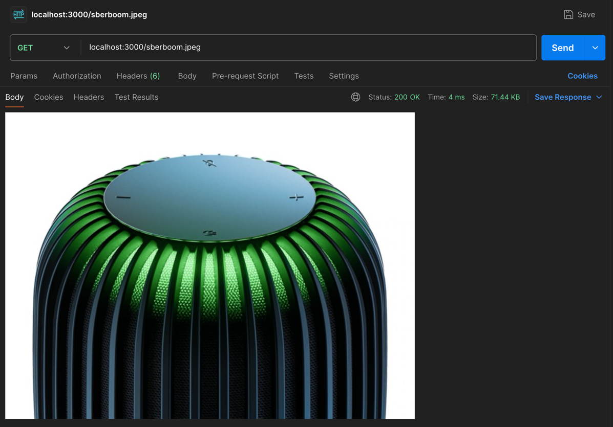
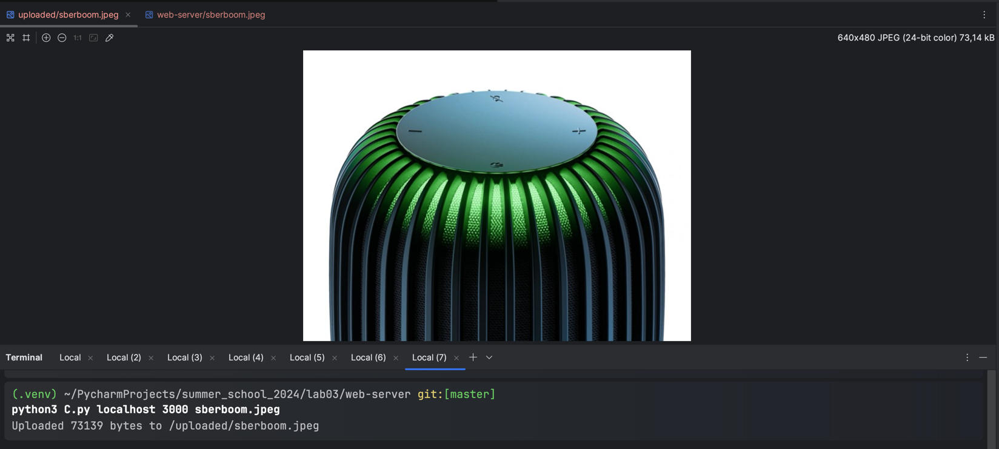
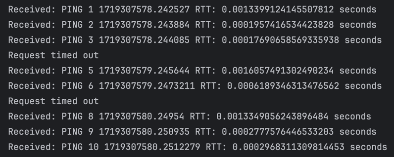
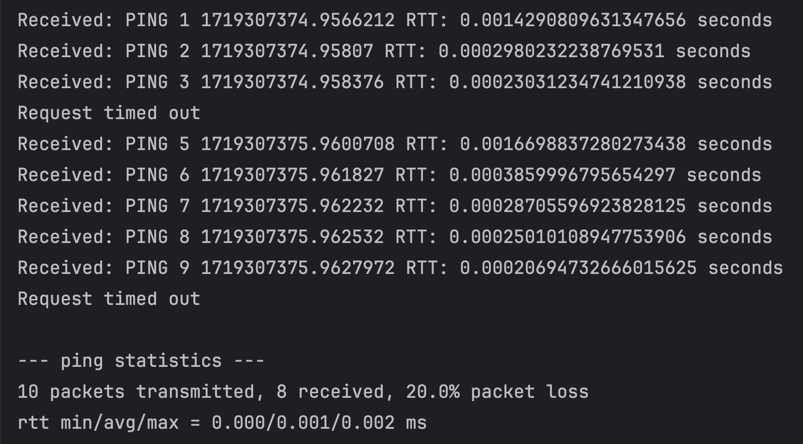

# Практика 3. Прикладной уровень

## 1. Программирование сокетов. Веб-сервер

### А. Однопоточный веб-сервер (3 балла)
Вам необходимо разработать простой веб-сервер, который будет возвращать содержимое
локальных файлов по их имени. В этом задании сервер умеет обрабатывать только один запрос и
работает в однопоточном режиме. Язык программирования вы можете выбрать любой.
Требования:
- веб-сервер создает сокет соединения при контакте с клиентом (браузером) получает HTTP-запрос из этого соединения
- анализирует запрос, чтобы определить конкретный запрашиваемый файл
- находит запрошенный файл в своей локальной файловой системе
- создает ответное HTTP-сообщение, состоящее из содержимого запрошенного файла и предшествующих ему строк заголовков
- отправляет ответ через TCP-соединение обратно клиенту
- если браузер запрашивает файл, которого нет на веб-сервере, то сервер должен вернуть сообщение об ошибке «404 Not Found»

Ваша задача – разработать и запустить свой локальный веб-сервер, а затем проверить его
работу при помощи отправки запросов через браузер. Продемонстрируйте работу сервера, приложив скрины.

Скорее всего порт 80 у вас уже занят, поэтому вам необходимо использовать другой порт для
работы вашей программы.

Формат команды для запуска сервера:
```
<server.exe> server_port
```

#### Демонстрация работы


### Б. Многопоточный веб-сервер (2 балла)
Реализуйте многопоточный сервер, который мог бы обслуживать несколько запросов
одновременно. Сначала создайте основной поток (процесс), в котором ваш модифицированный
сервер ожидает клиентов на определенном фиксированном порту. При получении запроса на
TCP-соединение от клиента он будет устанавливать это соединение через другой порт и
обслуживать запрос клиента в отдельном потоке. Таким образом, для каждой пары запрос-ответ
будет создаваться отдельное TCP-соединение в отдельном потоке.

### В. Клиент (2 балла)
Вместо использования браузера напишите собственный HTTP-клиент для тестирования вашего
веб-сервера. Ваш клиент будет поддерживать работу с командной строкой, подключаться к
серверу с помощью TCP-соединения, отправлять ему HTTP-запрос с помощью метода GET и
отображать ответ сервера в качестве результата. Клиент должен будет в качестве входных
параметров принимать аргументы командной строки, определяющие IP-адрес или имя сервера,
порт сервера и имя файла на сервере. Продемонстрируйте работу клиента, приложив скрины. 

Формат команды для запуска клиента:
```
<client.exe> server_host server_port filename
```

#### Демонстрация работы


## 2. Почта и SMTP (7 баллов)

### А. Почтовый клиент (2 балла)
Напишите программу для отправки электронной почты получателю, адрес
которого задается параметром. Адрес отправителя может быть постоянным. Программа
должна поддерживать два формата сообщений: **txt** и **html**. Используйте готовые
библиотеки для работы с почтой, т.е. в этом задании **не** предполагается общение с smtp
сервером через сокеты напрямую.

Приложите скриншоты полученных сообщений (для обоих форматов).

#### Демонстрация работы


### Б. SMTP-клиент (3 балла)
Разработайте простой почтовый клиент, который отправляет текстовые сообщения
электронной почты произвольному получателю. Программа должна соединиться с
почтовым сервером, используя протокол SMTP, и передать ему сообщение.
Не используйте встроенные методы для отправки почты, которые есть в большинстве
современных платформ. Вместо этого реализуйте свое решение на сокетах с передачей
сообщений почтовому серверу.

Сделайте скриншоты полученных сообщений.

#### Демонстрация работы


### В. SMTP-клиент: бинарные данные (2 балла)
Модифицируйте ваш SMTP-клиент из предыдущего задания так, чтобы теперь он мог
отправлять письма с изображениями (бинарными данными).

Сделайте скриншот, подтверждающий получение почтового сообщения с картинкой.

#### Демонстрация работы


---

_Многие почтовые серверы используют ssl, что может вызвать трудности при работе с ними из
ваших приложений. Можете использовать для тестов smtp сервер СПбГУ: mail.spbu.ru, 25_

## 3. Эхо-запросы через UDP
Реализуйте сервер для пингования, а также его клиента.

### А. Серверная часть (2 балла)
Сервер находится в бесконечном цикле, ожидая приходящие UDP-пакеты.
Если пакет прибывает, то сервер просто изменяет символы входящего сообщения на заглавные и
отправляет их обратно клиенту. Серверный код должен моделировать 20% потерю пакетов.

### Б. Клиентская часть (2 балла)
Клиент должен отправить 10 эхо-запросов серверу. Поскольку UDP является ненадежным с точки
зрения доставки протоколом, то пакет, отправленный от клиента к серверу или наоборот, может
быть потерян в сети. Так как клиент не может бесконечно ждать ответа на запрос, нужно задать
период ожидания ответа (тайм-аут), равный одной секунде – если ответ не будет получен в
течение одной секунды, клиентская программа должна предполагать, что пакет потерян.

Ваша клиентская программа должна:
- отправить эхо-запрос, используя UDP
- распечатать ответное сообщение от сервера (если такое есть)
- вычислить и вывести на печать время оборота (RTT) в секундах для каждого пакета при
ответе сервера
- в противном случае, вывести сообщение «Request timed out»

Формат сообщения:
`Ping номер_последовательности время`
- номер_последовательности начинается с 1 и увеличивается до 10 для каждого
последующего сообщения, отправленного клиентом
- время – это момент времени, когда клиент отправляет сообщение

Сделайте скриншоты, подтверждающие корректную работу вашей программы пингования со стороны клиента.

#### Демонстрация работы


### В. Вывод в формате ping (2 балла)
Версия клиента из предыдущей части (Б) вычисляет время оборота для каждого пакета и выводит
его отдельно. Измените вывод таким образом, чтобы он соответствовал тому, как это делается в
стандартной утилите ping.

Для этого вам нужно будет сообщить минимальное, максимальное и среднее значение RTT в
конце каждого ответа от сервера. Дополнительно вычислите коэффициент потери пакетов (в
процентах).

#### Демонстрация работы


## 4. Удаленное рисование (6 баллов)
Программа удаленного рисования. На первом компьютере (клиент) пользователь может рисовать
кривые мышкой на «холсте». На втором на таком же холсте (сервер) рисунок повторяется в
реальном времени. Вы можете использовать любой протокол для реализации данного
приложения. Предоставьте скриншот работы приложения.

#### Демонстрация работы
/images/dist-draw.mov